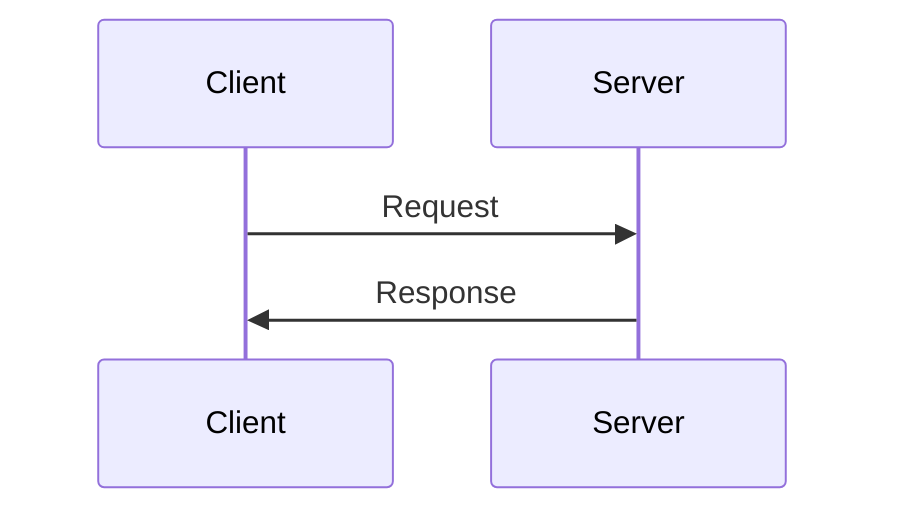
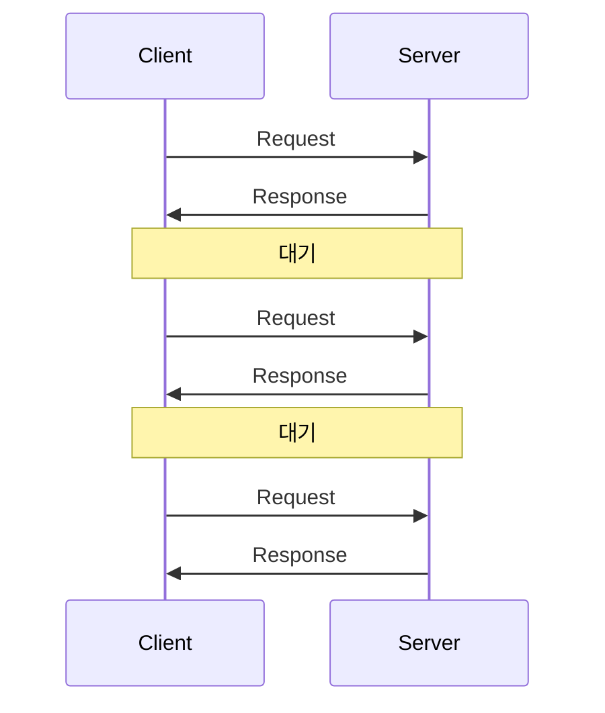
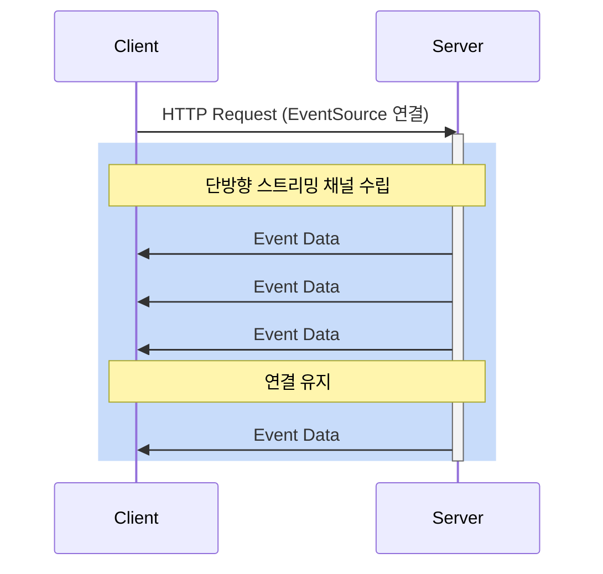
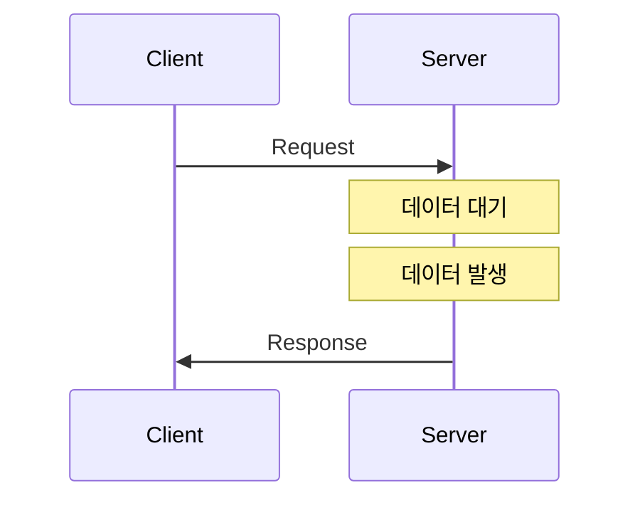
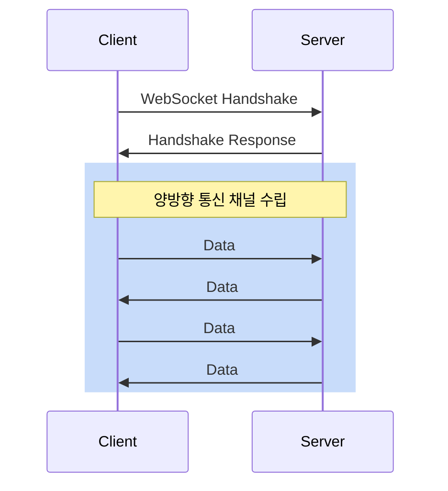
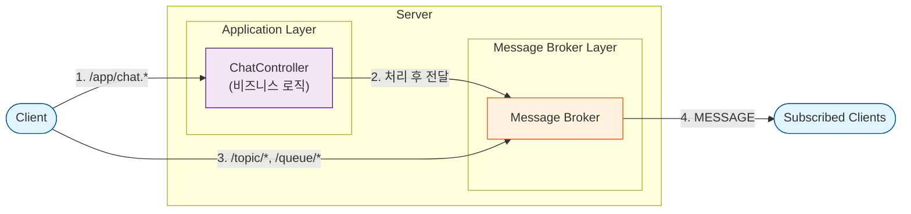

# WebSocket Chat Application

WebSocket과 STOMP를 사용한 실시간 채팅 애플리케이션입니다.

## 웹소켓(WebSocket)이란?

WebSocket은 클라이언트와 서버 간의 양방향 통신을 지원하는 프로토콜입니다.

### 기존 HTTP 통신 방식들

#### 1. 일반 HTTP 통신



특징:

- **단방향 통신**: 클라이언트의 요청이 있을 때만 서버가 응답
- **비연결성**: 요청-응답 후 연결 종료
- **간단한 구현**: 기본적인 HTTP 요청/응답 구조
- **리소스 효율**: 필요할 때만 연결

사용 사례:

- 일반적인 웹 페이지 로딩
- REST API 호출
- 파일 다운로드/업로드

#### 2. 폴링(Polling)



특징:

- **주기적 요청**: 클라이언트가 정해진 간격으로 서버에 요청
- **서버 부하**: 불필요한 요청이 많이 발생
- **실시간성 부족**: 폴링 주기만큼의 지연 발생
- **구현 용이**: 단순한 구현 방식

사용 사례:

- 간단한 알림 시스템
- 주기적 데이터 업데이트
- 이메일 확인

#### 3. HTTP 스트리밍(Server-Sent Events)



특징:

- **단방향 통신**: 서버에서 클라이언트로의 실시간 데이터 스트리밍
- **자동 재연결**: 연결이 끊어질 경우 자동으로 재연결 시도
- **이벤트 기반**: 서버에서 발생하는 이벤트를 실시간으로 클라이언트에 전달
- **기본 HTTP 사용**: 별도의 프로토콜이 필요 없음
- **낮은 오버헤드**: WebSocket보다 가벼운 구현

사용 사례:

- 실시간 알림
- 주식 시세 업데이트
- 소셜 미디어 피드
- 실시간 로그 모니터링

#### 4. 롱 폴링(Long Polling)



특징:

- **대기 상태 유지**: 서버가 데이터 발생할 때까지 연결 유지
- **실시간성 향상**: 폴링 대비 빠른 응답
- **서버 리소스**: 연결 유지로 인한 서버 부하
- **타임아웃 고려**: 연결 시간 제한 설정 필요

사용 사례:

- 채팅 애플리케이션
- 실시간 알림
- 게임 상태 업데이트

### WebSocket 통신 방식



### WebSocket의 장점

1. **효율성**
   - 한 번 연결 수립 후 계속 사용
   - 헤더 오버헤드 감소
   - 실시간 데이터 전송 가능

2. **실시간성**
   - 지연 없는 양방향 통신
   - 서버에서 클라이언트로 즉시 푸시 가능

3. **자원 절약**
   - 불필요한 요청/응답 없음
   - 서버 부하 감소
   - 네트워크 트래픽 감소

## WebSocket 관련 기술

### WebSocket 기반 프로토콜

#### 1. STOMP (Simple Text Oriented Messaging Protocol)

- **특징**: HTTP와 유사한 프레임 기반 프로토콜
- **장점**:
  - 메시지 형식이 정형화되어 있음
  - pub/sub 패턴 지원
  - Spring에서 기본 지원
- **사용 사례**: 채팅, 메시징 시스템

#### 2. MQTT (Message Queuing Telemetry Transport)

- **특징**: IoT에 특화된 경량 메시징 프로토콜
- **장점**:
  - TCP/IP 기반으로 동작 (WebSocket은 전송 옵션 중 하나)
  - QoS(Quality of Service) 레벨 지원
  - 작은 메시지 크기
- **사용 사례**: IoT 디바이스, 센서 네트워크

#### 3. WAMP (Web Application Messaging Protocol)

- **특징**: 분산 시스템을 위한 통합 프로토콜
- **장점**:
  - RPC(Remote Procedure Call)와 pub/sub 패턴 모두 지원
  - 다양한 프로그래밍 언어 지원
  - 확장 가능한 구조
- **사용 사례**: 분산 시스템, 마이크로서비스 아키텍처

### WebSocket 클라이언트 라이브러리

#### 1. Socket.IO

- **특징**: WebSocket을 추상화한 JavaScript 라이브러리
- **장점**:
  - 자동 재연결
  - 폴백 메커니즘 내장
  - 이벤트 기반 통신
- **사용 사례**: 실시간 게임, 협업 도구

#### 2. SockJS

- **특징**: WebSocket 에뮬레이션 JavaScript 라이브러리
- **장점**:
  - WebSocket을 지원하지 않는 환경에서 대체 전송 제공
  - Spring과 높은 호환성
  - 자동 폴백 메커니즘
- **사용 사례**: 엔터프라이즈 웹 애플리케이션

### WebSocket 구현 방식

#### Raw WebSocket

- **특징**: 브라우저 제공 WebSocket API 직접 사용
- **장점**:
  - 최소한의 오버헤드
  - 커스텀 프로토콜 구현 가능
  - 가장 빠른 성능
- **사용 사례**: 저지연이 중요한 실시간 애플리케이션

## STOMP(Simple Text Oriented Messaging Protocol)

STOMP는 WebSocket 위에서 동작하는 메시징 프로토콜입니다. HTTP와 유사한 형식을 가집니다.

### STOMP 메시지 구조 예시

1.**연결 시 메시지**

````markdown
CONNECT
accept-version:1.1,1.0
heart-beat:10000,10000

^@
````

2.**구독 메시지**

````markdown
SUBSCRIBE
id:sub-0
destination:/topic/public

^@
````

3.**채팅 메시지 전송**

````markdown
SEND
destination:/app/chat.sendMessage
content-type:application/json
content-length:58

{"type":"CHAT","content":"안녕하세요","sender":"user1"}^@
````

4.**서버에서 클라이언트로 메시지 전달**

````markdown
MESSAGE
subscription:sub-0
message-id:123
destination:/topic/public
content-type:application/json

{"type":"CHAT","content":"안녕하세요","sender":"user1"}^@
````

### 구조 설명

- 첫 줄: 명령어(CONNECT, SUBSCRIBE, SEND, MESSAGE 등)
- 헤더: key:value 형식의 여러 줄
- 빈 줄: 헤더와 본문 구분
- 본문: JSON 등의 실제 데이터
- ^@: NULL 문자(메시지 종료 표시)

## Spring WebSocket 특징

### 1. Spring의 WebSocket 지원

- **@EnableWebSocketMessageBroker**: WebSocket 메시징 기능을 활성화
- **WebSocketMessageBrokerConfigurer**: WebSocket 설정을 위한 인터페이스 제공
- **메시지 브로커 옵션**:
  - **내장 브로커**: Simple Message Broker를 기본 제공
  - **외장 브로커**: RabbitMQ, ActiveMQ 등 연동 가능
    - 메시지 지속성
    - 클러스터링
    - 고가용성
    - 대규모 트래픽 처리

### 2. 메시지 핸들링

- **@MessageMapping**: WebSocket 메시지를 처리할 메서드 지정
- **@SendTo**: 메시지를 특정 주제로 발행
- **@SendToUser**: 특정 사용자에게만 메시지 전송
- **@DestinationVariable**: URL 템플릿 변수 바인딩

### 3. 보안 기능

- Spring Security와 통합 가능
- 사용자 인증/인가 처리
- CORS(Cross-Origin Resource Sharing) 설정

### 4. SockJS 폴백

- WebSocket을 지원하지 않는 환경에서 대체 전송 지원
- XHR Streaming
- XHR Polling
- 자동으로 최적의 전송 방식 선택

### 5. 세션 관리

- **WebSocketSession**: 클라이언트 연결 관리
- 세션 속성 저장 및 조회
- 연결 상태 모니터링

### 6. 에러 핸들링

- **@MessageExceptionHandler**: 메시지 처리 중 발생한 예외 처리
- 클라이언트에게 에러 메시지 전송
- 예외 유형별 처리 가능

## 프로젝트 아키텍처

### 시스템 구조

```markdown
Client (React) <--WebSocket/STOMP--> Server (Spring Boot)
     ↓                                    ↓
SockJS/StompJS                    Spring WebSocket
```

### 메시지 핸들링 흐름



메시지 유형:

1. 애플리케이션 메시지 (/app/*)
   - /app/chat.sendMessage : 채팅 메시지 전송
   - /app/chat.addUser : 사용자 입장

2. 브로커 메시지
   - /topic/* : 1:N 브로드캐스트
   - /queue/* : 1:1 메시지

3. 구독
   - /topic/public : 공개 채팅방
   - /user/queue/reply : 개인 메시지

## 기술 스택

### Backend (Project Stack)

- Spring Boot 3.2.1
- Spring WebSocket
- STOMP
- Gradle

### Backend (Setup)

### Frontend (Project Stack)

- React
- SockJS-client
- @stomp/stompjs
- Node.js

### Frontend (Setup)

## 프로젝트 구조

````markdown
spring-stomp-practice/
├── docker-compose.yml
├── spring-stomp-practice-back/  # 백엔드
└── spring-stomp-practice-front/ # 프론트엔드
````

## 실행 방법

### Docker Compose 사용

````markdown
# 프로젝트 클론
git clone https://github.com/your-username/spring-stomp-practice.git
cd spring-stomp-practice

# Docker Compose로 실행
docker-compose up --build
````

### 수동 실행

#### Backend

````markdown
cd spring-stomp-practice-back
./gradlew bootRun
````

#### Frontend

````markdown
cd spring-stomp-practice-front
npm install
npm start
````

## 접속 방법

- Frontend: http://localhost:3000 (개발 환경) 또는 http://localhost (Docker)
- Backend: http://localhost:8080

## 주요 기능

- 실시간 채팅
- 사용자 입장/퇴장 알림
- 자동 스크롤

## 구독 주제(Topics)

- `/topic/public`: 공개 채팅방 메시지

## 메시지 전송 경로

- `/app/chat.sendMessage`: 채팅 메시지 전송
- `/app/chat.addUser`: 사용자 입장
